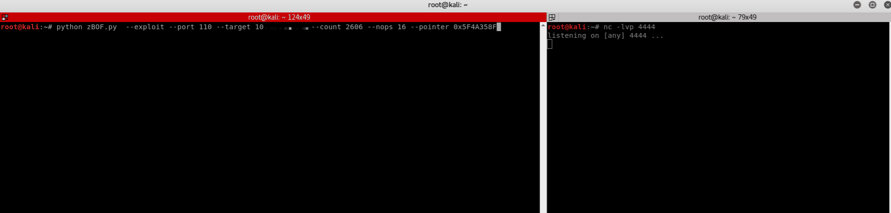

# zBOF.py

A modular tool for fuzzing and exploiting buffer overflow vulnerabilities. Created for the OSCP, but obviously broadly applicable to any stack-based buffer overflow. Enjoy!

    usage: zBOF.py [-h] [--target TARGET] [--port PORT] [--count COUNT]
                   [--pointer POINTER] [--fuzz] [--sub] [--nops NOPS] [--exploit]
                   [--badchars]

    optional arguments:
       -h, --help         show this help message and exit
       --target TARGET    Host IP to Target.
       --port PORT        Vulnerable port.
       --count COUNT      Number of 'A' for initial overflow.
       --pointer POINTER  JMP ESP Memory Address in 0x00000000 format.
       --fuzz             Fuzz with a really long patterned string.
       --sub              Utilize SUB ESP instead of NOPs.
       --nops NOPS        Number of NOPs to prepend to buffer.
       --exploit          Actively send shellcode to host.
       --badchars         Send full list of hex to host to check badchars.
`
